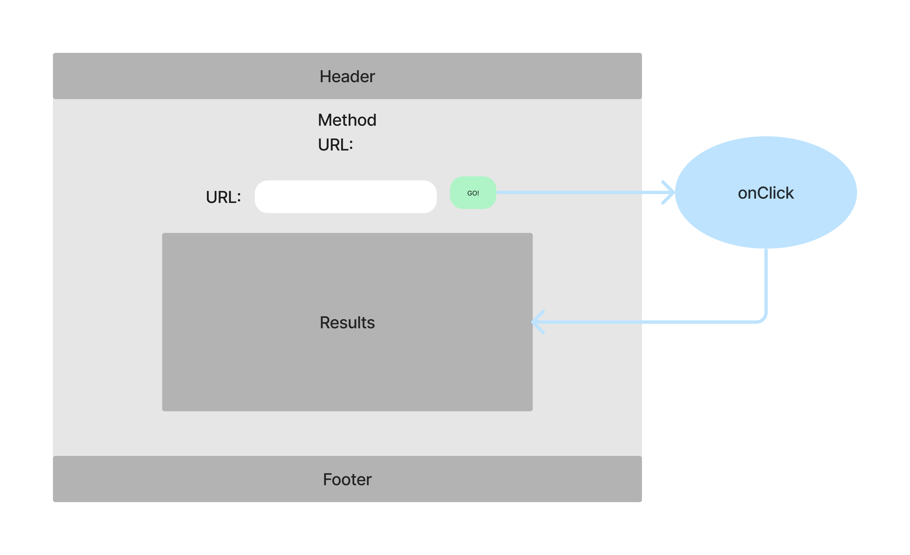
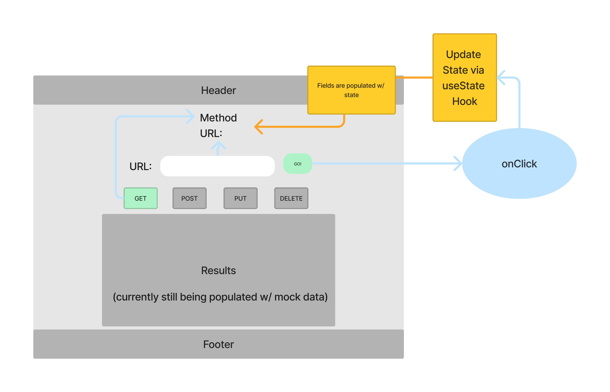
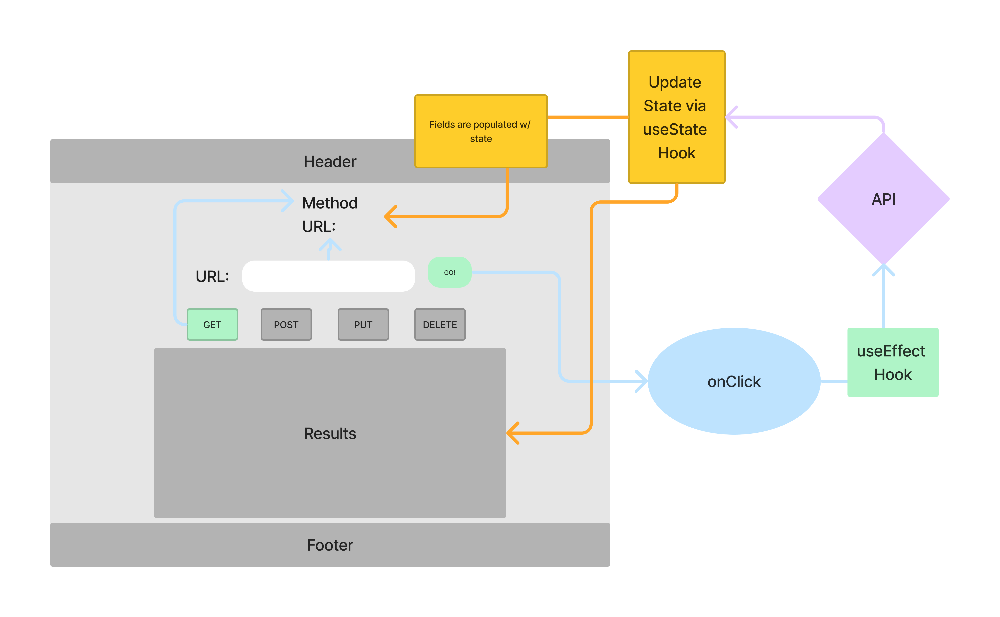

# RESTy

A browser based API testing tool

## Business Requirements

An API testing tool that can be run in any browser, allowing a user to easily interact with APIs in a familiar interface.

[Lab 26 CodeSandbox](https://codesandbox.io/p/github/xhillman/resty/lab26?file=%2Fsrc%2Findex.js&selection=%5B%7B%22endColumn%22%3A1%2C%22endLineNumber%22%3A12%2C%22startColumn%22%3A1%2C%22startLineNumber%22%3A12%7D%5D)

[Lab 27 CodeSandbox](https://codesandbox.io/p/github/xhillman/resty/lab27?file=%2Fsrc%2FApp.js&selection=%5B%7B%22endColumn%22%3A12%2C%22endLineNumber%22%3A3%2C%22startColumn%22%3A12%2C%22startLineNumber%22%3A3%7D%5D)

[Lab 28 CodeSandbox](https://codesandbox.io/p/github/xhillman/resty/effect-hook?file=%2FREADME.md)

### UML

